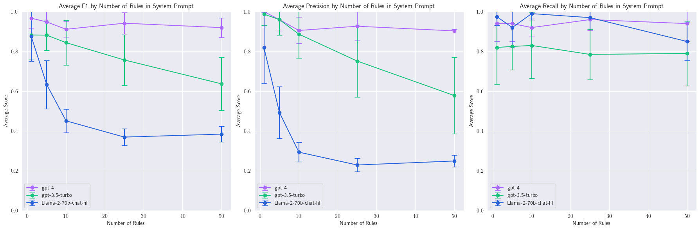

# Overwhelm LLM Eval

**How many rules can LLMs handle before they become overwhelmed?**

This repository contains the code and data used to evaluate LLMs and their ability to adhere to a growing number of rules.



## Overview 🔍

This benchmark is designed to explore how different LLMs, such as GPT-4, GPT-3.5, and LLAMA-2-70b-chat, respond to an increasing number of constraints introduced into their system prompts. The objective is to measure the capacity of these models to handle a growing set of rules without compromising their performance.

## Results 📊

The results of the experiment can be viewed in the `results.ipynb` file.

## Data 🗂️

All data produced during this experiment can be found in the `/data` directory.

The synthetic rules, which were generated by GPT-4, along with their corresponding _reject_ and _accept_ examples, are available in the `rules.json` file.

The model outputs for `gpt-4`, `gpt-3.5-turbo`, and `Llama-2-70b-chat-hf` are stored in the `results_*.json` files.

## Getting Started ⚙️

1. **Setup environment variables**:
```
cp .env.template .env
```
2. **Install required packages**:
```
pip install -r requirements.txt
```
3. **Generate synthetic rules and examples**:
```
python generate.py
```
4. **Run experiments**:

Run for all models (be careful, this can be **expensive**):
```
./run_experiments.sh
```
or run for a single model:
```
python experiment.py --eval_model gpt-3.5-turbo
```
